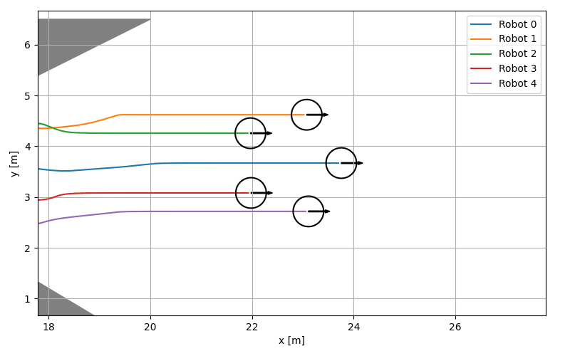

# Event-based Reconfiguration Control for Time-varying Robot Formation in Narrow Spaces
This repository presents the following article in Python:

Duy-Nam Bui, Manh Duong Phung, Hung Pham Duy, **"Event-based Reconfiguration Control for Time-varying Robot Formation in Narrow Spaces,"** *Intelligent Service Robotics*. 2025. 
[[Citation](#citation)].

## Installation
```
git clone git@github.com:duynamrcv/erc.git
pip install imageio numpy matplotlib
```

## Demo
We implement two controllers, includes the proposed controller `ERC` and the pure behavior controller `BC`, which are presented in `robot_erc.py` and `robot_bc.py`, respectively. To choose the tested controller, edit parameter `CONTROLLER` in `config.py`. To run the demo, run:
```
cd erc
python3 main.py
```
The data will be saved in `*.txt`. For the visualization, run:
```
python3 visualization.py
```

## Results
|Method| Pentagon shape | V-shape |
|:---:| :---:      |     :---:  |
|ERC|  |  |
|BC| |  |

## Citation
```
@ARTICLE{Nam2025,
  author={Bui, Duy-Nam and Phung, Manh Duong and Pham Duy, Hung},
  journal={Intelligent Service Robotics}, 
  title={Event-based Reconfiguration Control for Time-varying Robot Formation in Narrow Spaces}, 
  year={2025},
  volume={},
  number={},
  pages={1-12},
  doi={}}
```